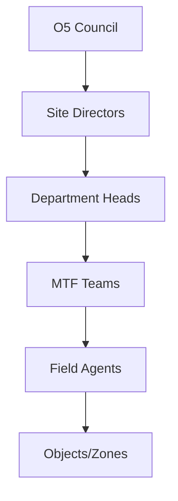

## Overview

CardioRightHand manages anomalous phenomena through strict protocols. You encounter objects with unpredictable properties, secure them in designated zones, and rely on structured hierarchies and specialized subdivisions. These core concepts form the foundation of containment operations.

<Columns cols={3}>
  <Card title="Anomalous Objects" icon="zap" href="#anomalous-objects">
    Classify and contain items exhibiting impossible behaviors.
  </Card>
  <Card title="Security Zones" icon="shield" href="#security-zones">
    Layered areas designed for escalating threat levels.
  </Card>
  <Card title="Structures & Hierarchies" icon="users" href="#structures">
    Command chains ensuring operational efficiency.
  </Card>
</Columns>

## Anomalous Objects and Classification

Anomalous objects, designated as CR-{number}, possess properties defying natural laws. You classify them based on containment difficulty and danger level.

<Callout kind="info">
  Always document initial observations before handling CR objects.
</Callout>

<Tabs>
  <Tab title="Safe" icon="check-circle">
    Easily contained with minimal resources. No active monitoring required post-setup.

    Example: CR-045, a self-repairing stethoscope that diagnoses untraceable diseases.
  </Tab>
  <Tab title="Euclid" icon="alert-triangle">
    Requires ongoing vigilance. Properties may shift unpredictably.

    Example: CR-112, a heartbeat monitor that synchronizes listeners' pulses across distances.
  </Tab>
  <Tab title="Keter" icon="x-circle">
    Extremely difficult to contain. High risk of escape or catastrophe.

    Example: CR-299, an autonomous heart organ pursuing mobile hosts uncontrollably.
  </Tab>
</Tabs>

<CodeGroup tabs="Procedure,Log">
  ```markdown
  Containment Procedure for CR-045:
  - Store in standard locker.
  - Annual inspection.
  ```
  ```json
  {
    "object": "CR-045",
    "class": "Safe",
    "containment": "Standard locker, annual check"
  }
  ```
</CodeGroup>

## Security Zones and Containment

Security zones segment facilities by risk. You progress from outer areas to inner high-security vaults.

| Zone | Access Level | Purpose | Examples |
|------|--------------|---------|----------|
| Zone A | Personnel | Administrative, low-risk storage | Offices, CR-Safe objects |
| Zone B | Clearance 2+ | Medium containment | Euclid procedures, testing labs |
| Zone C | Clearance 4+ | High-security | Keter vaults, emergency protocols |

<Expandable title="Zone Protocols" default-open="true">
  In Zone C, you activate lockdown if containment breaches occur. All personnel don full hazmat suits and follow evacuation routes.
</Expandable>

## Structures and Hierarchies

CardioRightHand operates under a rigid command structure. You report up the chain from field agents to O5 Council.



## Subdivisions and Their Functions

Specialized teams handle specific threats. You coordinate with these groups during operations.

<ExpandableGroup>
  <Expandable title="Mobile Task Force Alpha-1" default-open="true">
    Elite unit for O5 protection and high-threat retrievals. Deployed for Keter escapes.
  </Expandable>
  <Expandable title="Ethics Committee">
    Oversees humane treatment of affected individuals. Reviews termination proposals.
  </Expandable>
  <Expandable title="RAISA">
    Records and Information Security Administration. Manages all documentation and redaction.
  </Expandable>
</ExpandableGroup>

<Steps>
  <Step title="Classify Object" icon="search">
    Assess properties and assign CR designation.
  </Step>
  <Step title="Assign Zone" icon="shield">
    Match to appropriate security level.
  </Step>
  <Step title="Notify Subdivision" icon="users">
    Alert relevant teams for support.
  </Step>
</Steps>

<Callout kind="tip" kind="success">
  Master these concepts to contribute effectively to CardioRightHand operations.
</Callout>